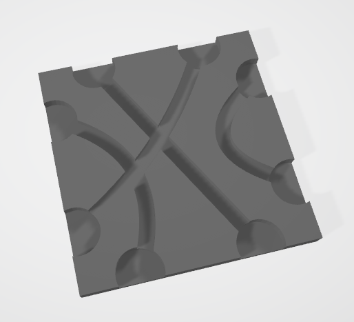

# Path Tiles Generator

This project generates Path Tiles board game tiles by enumerating all perfect matchings of swirling tracks on a square tile and exporting 3D models (STL) for 3D printing.

> **Compatible with Tsuro®. Not affiliated with or endorsed by Calliope Games.**



## Setup

1. Create and activate a virtual environment:

   ```bash
   python3 -m venv venv
   source venv/bin/activate  # Linux/macOS
   # or
   .\venv\Scripts\Activate.ps1  # Windows PowerShell
   ```

2. Install dependencies:
   ```bash
   pip install -r requirements.txt
   ```

## Usage

Generate all 105 unique tile patterns and export a sample as STL files:

```bash
# Generate matchings preview
python generate_path_tiles.py

# Export 36 random tiles (default)
python create_tile_mesh.py

# Export all 105 tiles
python create_tile_mesh.py --sample 105
```

## Command Line Options

```bash
python create_tile_mesh.py --help
```

### Key Arguments

- `--sample N`: Number of tiles to export (default: 36)
- `--tile-size FLOAT`: Tile size in mm (default: 100.0)
- `--tile-thickness FLOAT`: Tile thickness in mm (default: 5.0)
- `--channel-depth FLOAT`: Depth of channels in mm (default: 3.0)
- `--path-radius FLOAT`: Radius of path channels in mm (default: 2.0)
- `--dot-radius FLOAT`: Radius of endpoint dots in mm (default: 6.0)
- `--output DIR`: Output directory (default: "output")

### Examples

```bash
# Custom tile dimensions
python create_tile_mesh.py --tile-size 80 --tile-thickness 4

# Thicker tiles with deeper channels
python create_tile_mesh.py --tile-thickness 8 --channel-depth 5

# Export to custom directory
python create_tile_mesh.py --output my_tiles
```

## Sample Output

Check the `sample/` directory for example files:

- `sample/sample.png` - Tile pattern preview
- `sample/sample.stl` - 3D model ready for printing

## License

MIT License - feel free to adapt for personal or commercial use.
